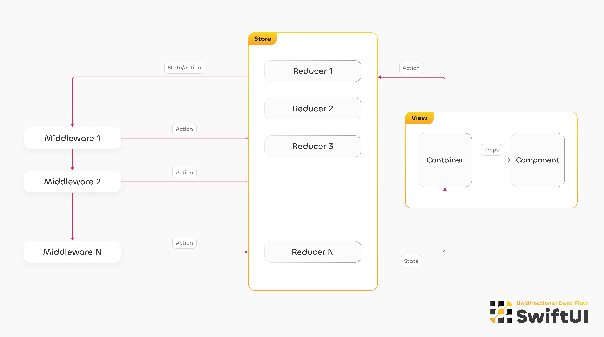

  

&nbsp;
## Architecture overview

  

&nbsp;
## Add-ons

| Name | Description               |
|-------------|---------------------------|
| [GenerambaTemplates](https://github.com/Maks-Jago/SwiftUI-UDF-GenerambaTemplate)| Templates for automatic generation of UDF modules with all the stubs, storages, and some features. |
| [UDFWebSocketsClient](https://github.com/urlaunched-com/UDFWebSocketsClient)| Implementation of a WebSocket client in UDF style, with ready-made solutions for easy connection and usage without extra effort. |
| [UDFCrashlyticsLogger](https://github.com/urlaunched-com/UDFCrashlyticsLogger)| Custom Logger for logging actioons to Firebase Crashlytics, both for crash reports and regular errors, with predefined actions filtering.
| [UDFAnalytics](https://github.com/urlaunched-com/UDFAnalytics)| Implementation of events logging, scenarios, update user properties, and other analytics settings in UDF style. Currently supported analytics platforms include Amplitude, Firebase, Mixpanel, AppsFlyer, and Facebook. |

&nbsp;
## Apps Built on SwiftUI-UDF

<table>
  <tr>
    <td align="center">
      
       
      <b>Wain</b>
    </td>
    <td align="center">
      
       
      <b>Cephalgo</b>
    </td>
    <td align="center">
      
       
      <b>Wishew</b>
    </td>
    <td align="center">
      
       
      <b>NanoHabits</b>
    </td>
    <td align="center">
      
       
      <b>Kanvo</b>
    </td>
    <td align="center">
      
       
      <b>MetaStudio</b>
    </td>
    <td align="center">
      
       
      <b>FlatPlanet</b>
    </td>
  </tr>
  <tr>
    <td align="center">
      
       
      <b>Kopi</b>
    </td>
    <td align="center">
      
       
      <b>Flick</b>
    </td>
    <td align="center">
      
       
      <b>StupidRaisins</b>
    </td>
    <td align="center">
      
       
      <b>MamaTalk</b>
    </td>
    <td align="center">
      
       
      <b>Ecorial</b>
    </td>
    <td align="center">
      
       
      <b>MeditationSchool</b>
    </td>
    <td align="center">
      
       
      <b>CNDA Event</b>
    </td>
  </tr>
  <tr>
    <td align="center">
      
       
      <b>FireFly</b>
    </td>
    <td align="center">
      
       
      <b>Chatsumer B</b>
    </td>
     <td align="center">
      
       
      <b>Chatsumer</b>
    </td>
    <td align="center">
      
       
      <b>Breverie</b>
    </td>
    <td align="center">
      
       
      <b>CasualAthletes</b>
    </td>
    <td align="center">
      
       
      <b>Celebrity NDA</b>
    </td>
    <td align="center">
      
       
      <b>Zippit</b>
    </td>
  </tr>
  <tr>
    <td align="center">
      
       
      <b>SkillApp</b>
    </td>
    <td align="center">
      
       
      <b>Librarius</b>
    </td>
    <td align="center">
      
       
      <b>Youmari</b>
    </td>
  </tr>
</table>

&nbsp;
*P.S. If your app is built using the SwiftUI-UDF architecture, please email me at mx.kuznetsov.dev@gmail.com to have your app added to this list. I would appreciate it.*

&nbsp;

## The license

The **SwiftUI-UDF** stays under the **Apache 2.0** license and is free to use.

- That means you have to mention "**Maksym Kuznietsov - Founder of [urlaunched.com](https://www.urlaunched.com)**" as the original author and reproduce the [LICENSE](./LICENSE) text inside your app;
- Including the full text of license in modified software.

If you have some questions or want to try and get all benefits of UDF architecture - write to **mx.kuznetsov.dev@gmail.com**
